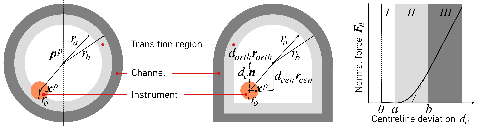

# Simulation of flexible instruments in curved channels
## Brief summary
This repository contains the relevant files for performing simulations of the behaviour of flexible instruments in curved channels using MATLAB and the computer program SPACAR. One application, that of simulating brachytherapy (BT) source cable behaviour and needle insertion in the curved applicator channels, is described in the article 'Multibody dynamic modelling of the behaviour of flexible instruments used in cervical cancer brachytherapy'. For these computer models, BT instruments were discretised in finite elements. Simulations were performed in the full version of SPACAR by formulating nodal contact force and motion input models, and defining kinematic and dynamic modules. Example files for performing rigid and flexible multibody simulation of a needle in an S-shaped channel are included in this repository. These files may be modified to simulate deformations and associated forces and moments of any type of slender elastic rod inside a rigid (circular) channel or environment.

The code in this repository is a simplification of the code used in:
- **Title**: Multibody dynamic modelling of the behaviour of flexible instruments used in cervical cancer brachytherapy.
- **Authors**: Robin Straathof, Jaap P. Meijaard, Sharline van Vliet-Pérez, Inger-Karine K. Kolkman-Deurloo, Remi A. Nout, Ben J.M. Heijmen, Linda S.G.L. Wauben, Jenny Dankelman, and Nick J. van de Berg.
- **Journal**: Medical Physics
- **DOI**: **FIXME**
- **Cite repository**: [link](https://doi.org/10.4121/21714143) (4TU.Researchdata)
- **License**: see license file in repository.

## About SPACAR
The computer program [SPACAR](https://www.spacar.nl/) is based on the non-linear finite element theory for multi-degree of freedom mechanisms. The program is capable of analysing the dynamics of planar and spatial mechanisms and manipulators with flexible links and treats the general case of coupled large displacement motion and small elastic deformation. The motion can be simulated by solving the complete set of non-linear equations of motion or by using the so-called perturbation method. The computational efficiency of the latter method can be improved further by applying modal techniques.

## Kinematics, dynamics and simulations in SPACAR
Brief descriptions of the kinematic and dynamic analyses that are performed internally in SPACAR are given below. For an extensive description of SPACAR the reader is referred to the dissertation by Jonker [[1]](#references).

### Kinematics
We first want to establish a kinematic model which relates the configuration and deformations at any time point given a set of independent input coordinates. In the flexible case, the BT source cable or combined catheter/obturator is represented through an assembly of interconnected spatial Timoshenko beam elements. For a rigid multibody case, these are represented through rigid beams interconnected with torsion springs. The $k$ th element is described by a set of nodal coordinates $\boldsymbol{x}^{(k)}$ inside configuration space $X^{(k)}$, and a vector of deformation mode coordinates $\boldsymbol{e}^{(k)}$ inside deformation space $E^{(k)}$. For the entire system we may find the continuity map from mechanism configuration space to deformation space from the union of functions relating nodal and deformation mode coordinates per element:

$$
\boldsymbol{D} = \bigcup_{k} \boldsymbol{D}^{(k)}, \text{  } \boldsymbol{e} = \boldsymbol{D}(\boldsymbol{x}) \tag{1}
$$

The derivative of this continuity map is denoted as $\text{D}\boldsymbol{D}$. In the kinematic analysis we want to determine the configuration and deformations which result from the mapping of a set of given generalised coordinates, denoted with superscript $^{(m)}$:

$$
\boldsymbol{x}=\boldsymbol{F}^{(x)}(\boldsymbol{x}^{(m)},\boldsymbol{e}^{(m)}), \text{  } \boldsymbol{e}=\boldsymbol{F}^{(e)}(\boldsymbol{x}^{(m)},\boldsymbol{e}^{(m)}) \tag{2}
$$

The map $\boldsymbol{F}$ is known as the geometric transfer function. To relate the geometric transfer function to the continuity map, the relations in Eq. (2) are substituted in Eq. (1):

$$
\boldsymbol{F}^{(e)} = \boldsymbol{D} \circ \boldsymbol{F}^{(x)} \tag{3}
$$

Both $\boldsymbol{F}^{(e)}$ and $\boldsymbol{F}^{(x)}$ are unknown. However, we can obtain the first order geometric transfer functions $\text{D}\boldsymbol{F}^{(e)}$ and $\text{D}\boldsymbol{F}^{(x)}$, and second order geometric functions $\text{D}^2\boldsymbol{F}^{(e)}$ and $\text{D}^2\boldsymbol{F}^{(x)}$ in terms of the known derivative maps $\text{D}\boldsymbol{D}$ and $\text{D}^2\boldsymbol{D}$. Then, from an initial duple ( $\boldsymbol{x}_ {0}$, $\boldsymbol{e}_ {0}$) we can find the new duple after one time step from the Taylor series expansion:

$$
\boldsymbol{x}_ 1 = \boldsymbol{x}_ 0 + \text{D}\boldsymbol{F}_ 0^{(x)}⋅(\Delta \boldsymbol{x}^{(m)},\Delta \boldsymbol{e}^{(m)}) + \frac{1}{2} (\text{D}^2\boldsymbol{F}_ 0^{(x)}⋅(\Delta \boldsymbol{x}^{(m)},\Delta \boldsymbol{e}^{(m)}))⋅(\Delta \boldsymbol{x}^{(m)},\Delta \boldsymbol{e}^{(m)}))
$$

$$
\boldsymbol{e}_ 1 = \boldsymbol{e}_ 0 + \text{D}\boldsymbol{F}_ 0^{(e)}⋅(\Delta \boldsymbol{x}^{(m)},\Delta \boldsymbol{e}^{(m)}) + \frac{1}{2}  (\text{D}^2\boldsymbol{F}_ 0^{(e)}⋅(\Delta \boldsymbol{x}^{(m)},\Delta \boldsymbol{e}^{(m)}))⋅(\Delta \boldsymbol{x}^{(m)},\Delta \boldsymbol{e}^{(m)})) \tag{3}
$$

To guarantee that the configuration and deformations remain interlinked, an iteration process using a Newton-Raphson scheme is applied in SPACAR to ensure that $\boldsymbol{D}^{(m)} (\boldsymbol{x}_ 1)=\boldsymbol{e}_ 1^{(m)}$ holds. This scheme is then applied to calculate the sequence of generalised coordinates $(\boldsymbol{x}^{(m)},\boldsymbol{e}^{(m)})$.

### Dynamics
In the forward dynamic analysis, we want to obtain the mechanism’s configuration, velocities and accelerations from prescribed nodal loads through a set of equations of motion. These equations are derived from the Lagrangian form of d’Alembert’s principle of virtual work. For rigid elements this analysis is trivial and uses a lumped mass formulation. However, for flexible elements the dynamics are influenced by both their inertia and stiffness properties, and hence a consistent mass formulation is used in SPACAR. This assumes that the position along a flexible element can be described using polynomial interpolation. The derivation of the consistent mass matrix is based on the concept of virtual power. A three-dimensional deformed beam with nodes $p$ and $q$ can be described by six Cartesian coordinates $\[ \boldsymbol{x}^{p^{(k)}},\boldsymbol{x}^{q^{(k)}} \]$ and two sets of Euler parameters $\[ \lambda^{p^{(k)}},\lambda^{q^{(k)}} \]$. Additionally, six deformation modes can be distinguished for the beam: elongation $e_ 1^{(k)}$, torsion $e_ 2^{(k)}$, and four parameters for bending $e_ {3-6}^{(k)}$, (see [Fig. 1](#figure1)). As such, we can define a position vector $\boldsymbol{r}^s$ that describes the location of point $s$ at normalised distance $ξ$ from point $p$ of the deflected beam as a function of bending deformation modes $e_ {3-6}$ using cubic polynomial interpolation. From the principle of virtual work we then obtain:

$$
\boldsymbol{f}⋅\boldsymbol{\dot{x}}-\boldsymbol{σ}⋅\text{D}\boldsymbol{D}\boldsymbol{\dot{x}}-ml \int_{0}^{1} \boldsymbol{\dot{r}}^s⋅\boldsymbol{\ddot{r}}^s \text{d}ξ = 0 \tag{4}
$$

Here, the dot is used to denote the time derivative, $\boldsymbol{f}$ the nodal loads (including forces and torques), $\boldsymbol{σ}$ the stresses, and $m$ the mass and $l$ the length of the element. Stresses $\boldsymbol{σ}$ are calculated using Hooke’s law. The right part of Eq. (4) can be further evaluated by differentiating $\boldsymbol{r}^s$ with respect to time (twice), to obtain the consistent mass matrices and convective inertia tensors associated with quadratic velocity terms. The equations of motion can now be derived again using the principle of virtual power, and after arranging:

$$
\text{D}\boldsymbol{F}^T \boldsymbol{M} \text{D}\boldsymbol{F} {\left\lbrack \matrix{\boldsymbol{\ddot{x}}^{(m)} \cr \boldsymbol{\ddot{e}}^{(m)}} \right\rbrack}=\text{D}\boldsymbol{F}^T {\left\lbrack \matrix{\boldsymbol{f}+\boldsymbol{f}_ {in} \cr -\boldsymbol{σ}-\boldsymbol{σ}_ {in}} \right\rbrack} \tag{5}
$$

Here, $\text{D}\boldsymbol{F}^T \boldsymbol{M} \text{D}\boldsymbol{F}$ is the system mass matrix, containing both consistent and lumped mass matrices, and $\boldsymbol{f}_ {in}$ and $\boldsymbol{σ}_ {in}$ are the inertia forces and stresses respectively. Eq. (5) can be integrated numerically to obtain the configuration and deformations of the mechanism and their velocities at an adjacent time step. Finally, reaction forces and internal stresses may be calculated from kinetostatic analysis.

| |
|:--:| 
|  **Figure 1**. Reference beam configuration (left) and two representations of deformed beam configurations (middle and right). The beam configuration in the middle shows six deformation modes for a flexible beam element: elongation $e_ {1}$, torsion $e_ {2}$, and bending $e_ {3-6}$. The beam configuration on the right is similar to the configuration in the middle, but this is achieved through three relative rotations $e_ {1}$ of connected hinges drawn as cans in series, whereas the beam itself is rigid. Figure adapted from Jonker and Meijaard [[2]](#references).|

### Finite element representation
For flexible multibody models, the instrument can be modelled as a set of flexible (planar) beam elements with the SPACAR command $\text{BEAM}$. In this case, deformations in all directions are permitted with exception of elongation (i.e. beams are inextensible) \[[Fig. 1](#figure1)\]. In the case of rigid multibody models, the instrument can be modelled as a set of rigid multibody links \( $\text{RBEAM}$ \) interconnected with three hinge elements (with perpendicular axes) \( $\text{HINGE}$ \) \[[Fig. 1](#figure1)\]. The bending stiffness of a joint in the rigid multibody models can be found by equalling the strain energy resulting from bending a flexible beam element with the energy stored by a torsion spring [[3]](#references):

$$
U=\frac{1}{2} S_ {rig,1} θ^2=\frac{EIl}{2R^2}  \tag{6} 
$$

In this equation, $θ$ is the angle subtending the element, $R$ the bending radius of the beam, and $l$ the element length. By substituting $θ=l/R$, the bending stiffness of a joint is:

$$
S_ {rig,1} = \frac{EI}{l} \tag{7} 
$$

Similarly, the stiffness of the torsion springs in the axial direction of the instrument can be found via $S_ {rig,1} = \frac{GJ}{l}$. 

### Contact detection and friction model 
To guide the flexible instruments through the channels, contact points must be determined, loads must be calculated and translated to loads on the nodes of the model.  For each node of the instrument, $\boldsymbol{x}^p$, the Euclidean distance to the centreline is computed using the MATLAB function $\text{distance2curve}$ [[4]](#references). This function returns the distance to the centreline, $d_c$, and the closest point on the centreline $\boldsymbol{p}^p$. The centreline of the channel may be modelled as any type of curve, e.g. a piecewise curve. The normal and tangent vectors, which are required for the normal and friction forces respectively, can then be obtained via:

$$
\boldsymbol{n} = \frac{\boldsymbol{x}^p-\boldsymbol{p}^p}{||\boldsymbol{x}^p-\boldsymbol{p}^p||}, \text{  } \boldsymbol{t} = \frac{\boldsymbol{\dot{x}}^p-v_ {c,n} \boldsymbol{n}}{||\boldsymbol{\dot{x}}^p-v_ {c,n} \boldsymbol{n}||} \tag{8}
$$

Here, $v_ {c,t}$ and $v_ {c,n}$ are determined from the instantaneous velocity $\boldsymbol{v}_ {c}$ at the point of contact:

$$
\boldsymbol{v}_ {c} = \boldsymbol{\dot{x}}^p + r_o \boldsymbol{ω}^p \times \boldsymbol{n} \tag{9}
$$

The angular velocity is calculated from the Euler parameters via $(0,\boldsymbol{ω}^p)^T= \bar{\boldsymbol{Q}}^{p^{T}} \boldsymbol{\dot{\lambda}}^p$, where $\bar{\boldsymbol{Q}}^{p}$ is a quaternion matrix [[5]](#references). Normal forces are computed using the contact model by Khatait et al. which distinguishes three different regions, characterised by the parameters $a$ and $b$ (see [Fig. 2](#figure2)) [[6]](#references). This model assumes that the normal force increases linearly with increasing wall penetration. A transition region in-between is considered to aid the convergence of SPACAR:
- No contact: $d_c \< a$;
* Transition zone: $a≤d_c≤b$. Here the wall stiffness and damping increase with increasing centreline deviation according to a second order polynomial;
+ Full contact zone:  $b \< d_c$. Here the wall stiffness is linear in penetration depth.

To include the thickness of the instrument we write: $a=r_a-r_o$ and $b=r_b-r_o$. Here, $r_o$ is the outer radius of the instrument, $r_b$ marks the radius of the channel and $r_a$ is a parameter freely chosen by the user to mark the transition zone. Note that this is a simplification which assumes that the longitudinal axes of the instrument and channel are locally parallel to each other. As this is most critical at the tip of the instrument, a small correction is applied. The resulting normal force is defined as a function of the dimensionless centreline deviation $ζ=\frac{d_c-a}{b-a}$:

$$
\boldsymbol{F}_ {n}= F_n \boldsymbol{n}, \text{  } F_n = {\left\lbrace \matrix{0, & \text{if} \text{   } d_c \< a \cr - \frac{k}{2} (b-a)ζ^2-c_w(3-2ζ)ζ^2 v_ {c,n}, & \text{   } \text{if} \text{   } a≤d_c≤b \cr -k(b-a)(ζ-\frac{1}{2})-c_w v_ {c,n}, & \text{   } \text{if} \text{   } b \< d_c} \right\rbrace} \tag{10}        
$$

Here, $k$ and $c_w$ are the wall stiffness and damping coefficient respectively. The friction model used by Khatait et al. is adapted in this work to also include the Stribeck friction effect (without viscous friction) [[7]](#references):

$$
\boldsymbol{F}_ {t}= F_t \boldsymbol{t}, \text{  } F_t =-\sqrt{2e}F_n(\mu_s-\mu_k) \text{exp}(-(\frac{v_ {c,t}}{v_ {brk} \sqrt{2}})^2) ⋅ \frac{v_ {c,t}}{v_ {brk} \sqrt{2}} + F_n \mu_k \text{tanh}(\frac{v_ {c,t}}{\frac{v_ {brk}}{10}}) \tag{11}
$$

Where, $\mu_s$ and $\mu_k$ are the static and kinematic friction coefficients respectively. The breakaway velocity $v_ {brk}$ is chosen as to aid convergence of the simulations. 

As the instrument has a certain thickness, the forces acting on the point of contact result in a moment around the node. As a result, the forces at the contact point can be modelled with the following equivalent loads on the node:

$$
{\left\lbrace \matrix{ \boldsymbol{F} = \boldsymbol{F}_ {t} + \boldsymbol{F}_ {n} \cr \boldsymbol{M} = r_o \boldsymbol{n} \times \boldsymbol{F}_ {t} } \right\rbrace} \tag{12}   
$$

The extension of this model to channels with convex polygonal cross-sections can be done relatively easy with a series of if-statements (see [Fig. 2](#figure2)).  

| |
|:--:| 
|  **Figure 2**. (a) Contact detection model for circular and U-shaped channels, (b)  Normal force model in a circular channel. Figure adapted from Khatait et al. [[6]](#references).|

## Implementation
After the path to the SPACAR installation folder is added in MATLAB, SPACAR can be activated using input from a $\text{.dat}$ file in MATLAB using the command ( $\text{spacar(\[mode\],\[filename\])}$ ). This input file contains the specification of kinematic and dynamic properties of the instrument, the numerical solver and integration settings, and links to user-specified force and input motion files. The $\text{.dat}$ files may be edited using any type of text editor (e.g. Notepad). Input forces and motion are specified in $\text{.m}$ functions. During the simulation, SPACAR writes data to $\text{.sbd}$ files and stores these in MATLAB arrays. Visualisation of the instrument's behaviour can be done using SpaVisual (SPACAR's visualisation tool), or in MATLAB.

## Requirements
This code was written and tested in MATLAB R2021b. The code provided here requires the following inputs:

_In same folder:_
- m20221212_RS_WP2_MAT_CatheterInsertionForce_V5.m: main MATLAB file with example simulation

- RIG_CAT_S.dat:  containing SPACAR inputs for rigid analysis    
- FLEX_CAT_S.dat: containing SPACAR inputs for flexible analysis
- FFESFVA.m:      containing user-defined force routine for flexible analysis
- FFESMVA.m:      containing user-defined motion routine for flexible analysis
- FRESFVA.m:      containing user-defined force routine for rigid analysis
- FRESMVA.m:      containing user-defined motion routine for rigid analysis

- distance2curve.m:   computing distance to curve by D'Errico [[4]](#references)
- LiePose.m:      computing centreline curve using Lie group / algebra theory

_In other folder:_
- SPACAR 2017 needs to be installed and linked to MATLAB

## Known bugs and issues
SPACAR may give the following MATLAB error when running the code: "ERROR while processing kinematic data. [...]". This may be caused by a limitation in the size of the analysis that can be performed using the standard downloadable version (see SPACAR manual). In case your requirements are larger, you may contact the
authors of SPACAR.

## Installation
1. Download the zip-file containing SPACAR (full) 2017 ([link](https://www.spacar.nl/wiki/doku.php?id=installation)) and extract this in a new folder 'spacar'.
2. Download the contents of the folder 'Functions' -containing the relevant MATLAB codes and other files required for the simulations- from this repository and extract this in a different folder. 
3. Download the $\text{distance2curve.m}$ function must be downloaded and add to this folder. 
4. Add the path to the SPACAR installation folder to the path in MATLAB in order to run the code.

## References
[1] Jonker B. (1988). _A Finite Element Dynamic Analysis of Flexible Spatial Mechanisms and Manipulators_. (TR diss 1625) [Doctoral dissertation, Delft University of Technology]. Institutional Repository ([link](https://repository.tudelft.nl/islandora/object/uuid:3f9f742f-1692-4cb8-8dd7-95c2d6024fd0?collection=research/)). p. 1-155.

[2] Jonker B., Meijaard J.P. (2012). Deformation Modes and Dual Stress Resultants of Spatial Beam Elements in Large Deflection Multibody System Analyses.  In _Proceedings of the 2nd Joint International Conference on Multibody System Dynamics_. p. 1-10.

[3] Alderliesten, T., Konings, M.K., & Niessen, W.J. (2004). Simulation of minimally invasive vascular interventions for training purposes. _Computer Aided Surgery_, 9(1-2), p. 3-15.

[4] D'Errico, J. (2021). _distance2curve_. MATLAB Central File Exchange ([link](https://nl.mathworks.com/matlabcentral/fileexchange/34869-distance2curve)).

[5] Schwab, A.L., Meijaard, J.P. (2006). How to draw Euler angles and utilize Euler parameters. In _International Design Engineering Technical Conferences and Computers and Information in Engineering Conference (Vol. 42568)_. p. 259-265.

[6] Khatait, J.P., Krijnen, M., Meijaard, J.P., Aarts, R.G., Brouwer, D.M., & Herder, J.L. (2011, January). Modelling and simulation of a flexible endoscopic surgical instrument in a tube. In _ASME International Mechanical Engineering Congress and Exposition (Vol. 54884)_. p. 557-566.

[7] Armstrong, B., & De Wit, C.C. (1996). Friction modeling and compensation. _The control handbook_, 77, p. 1369-1382.
